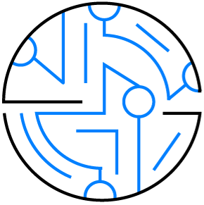
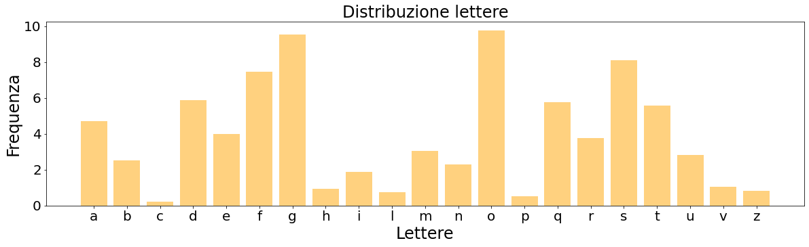
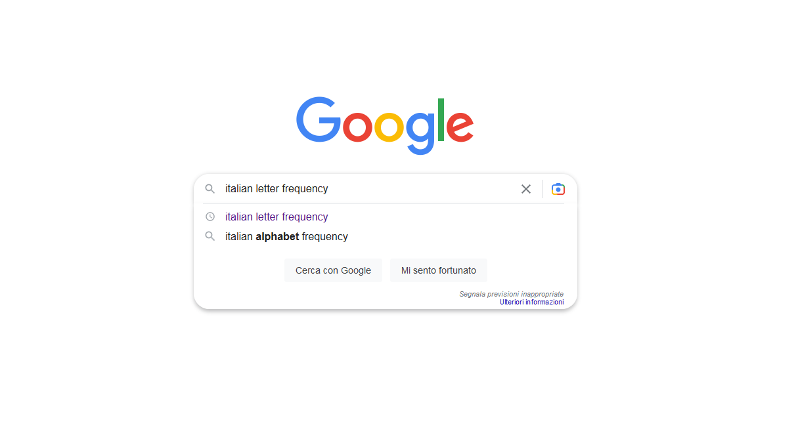
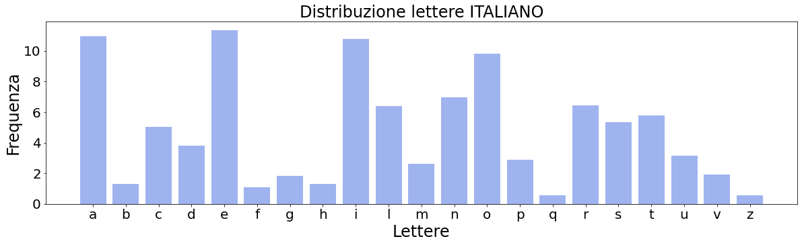
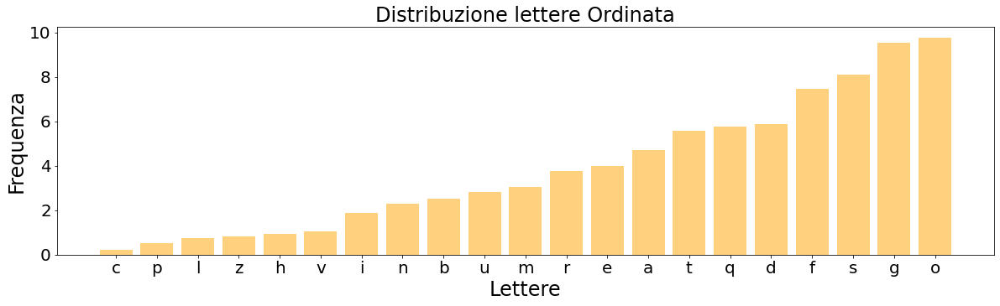
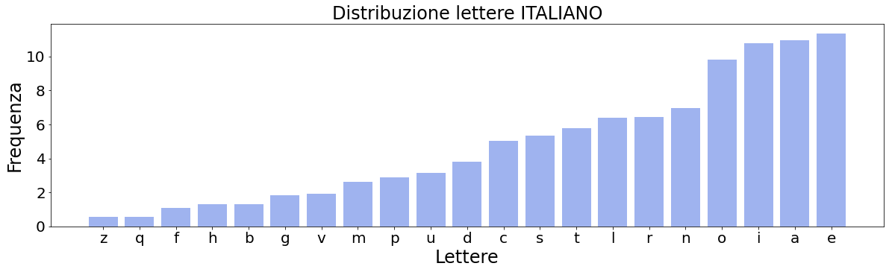

<!-- https://html-css-js.com/html/character-codes/ -->

<style>

  .container {
    position: relative;
  }

  .bottomright {
    position: absolute;
    bottom: 8px;
    right: 16px;
    font-size: 18px;
  }

  html.intro h1, h2, h3
  {
    background-color: rgba(255, 255, 255, 0.8);

    .reveal section img
    {
      filter: blur(1);
    }
  }

  table
  {
    font-family: arial, sans-serif;
    border-collapse: collapse;
    width: 100%;
  }

  td, th
  {
    border: 1px solid #dddddd;
    text-align: left;
    padding: 8px;
  }

  tr:nth-child(even)
  {
    background-color: #dddddd;
  }

  #textBox
  {
    padding: 10px 10px 20px 10px;
    border: 1px solid #BFBFBF;
    background-color: white;
    box-shadow: 10px 10px 5px #aaaaaa;
    opacity: 0.75;
  }

  #Box
  {
    padding: 10px 10px 20px 10px;
    border: 1px solid #BFBFBF;
    background-color: white;
    box-shadow: 10px 10px 5px #aaaaaa;
    opacity: 1;
  }

  .screen
  {
    position: absolute;
  }
  .innerdiv
  {
    position: absolute;
    top: 100%;
    right: 0;
  }

  .left
  {
    float:left;
    width:65px;
  }
  .right
  {
    float:left;
    margin:0 0 0 1px;
    width:400px;
  }

</style>

<script src='https://cdnjs.cloudflare.com/ajax/libs/mathjax/2.7.4/MathJax.js?config=default'></script>


<!-- .slide: data-background="./img/CircuitBoard-K-Wide.jpg" data-background-size="100%" style="color:black" -->

### Progetto PLS - La Programmazione in Pyton ed elaborazione dati

<p style="text-align: left; color:white">
  <span style="color:red"><b>Nico Curti</b></span><sup>1, 2</sup>, Alessandra Merlotti<sup>3</sup>, Francesco Durazzi<sup>1</sup>, Daniel Remondini<sup>1, 2</sup>
</p>

<p style="text-align: left; color:white; font-size: 20px;">
  <sup>1</sup> Department of Physics and Astronomy, University of Bologna<br>
  <sup>2</sup> INFN, Bologna<br>
  <sup>3</sup> Department of Experimental, Diagnostic and Specialty Medicine, University of Bologna<br>
</p>

<p style="align: center; color:white; font-size: 20px;">
  26/02/2023
</p>

---
<!-- .slide: data-background="./img/CircuitBoard-K-Wide.jpg" data-background-size="100%" style="color:black" -->

### Contacts & Info

<div style="width: 100%; overflow: hidden; text-align:left" >
  <div style="width: 400px; float: left;">
    
    <p style="align: center; color:white">
      Nico Curti (PhD)
    </p>
  </div>
  <div id="textBox" style="margin-left: 420px; text-align:left; font-size:25px">
    <div style="width: 50px; float: left;">
      
    </div>
    <div style="margin-left: 80px;">
      <p style="vspace: 40"></p>
      <a href="https://github.com/Nico-Curti">https://github.com/Nico-Curti</a>
    </div>
  </div>
  <p style="vspace: 20"></p>
  <div id="textBox" style="margin-left: 420px; text-align:left; font-size:25px">
    <div style="width: 50px; float: left;">
      
    </div>
    <div style="margin-left: 80px;">
      <p style="vspace: 40"></p>
      <a href="mailto:nico.curti2@unibo.it">nico.curti2@unibo.it</a>
    </div>
  </div>
  <p style="vspace: 20"></p>
  <div id="textBox" style="margin-left: 420px; text-align:left; font-size:25px">
    <div style="width: 150px; float: left;">
      <b>Groups:</b>
    </div>
    <div style="margin-left: 80px;">
      <a href="https://github.com/UniboDIFABiophysics">
        
      </a>
      <a href="https://github.com/UniboDIFABiophysics">
        
      </a>
      <a href="https://github.com/eDIMESLab">
        
      </a>
    </div>
  </div>
  <p style="vspace: 20"></p>
  <div id="textBox" style="margin-left: 420px; text-align:left; font-size:25px">
    <div style="width: 50px; float: left;">
      
    </div>
    <div style="margin-left: 80px;">
      <p style="vspace: 40"></p>
      Viale Berti Pichat 6/2 40127 Bologna (IT)
      <p>(Dept. Physics and Astronomy)</p>
    </div>
  </div>
  <p style="vspace: 20"></p>
</div>

---
<!-- .slide: data-background="./img/CircuitBoard-K-Wide.jpg" data-background-size="100%" style="color:black" -->

### Compito del giorno

<p style="color: white; text-align: left;">
  L'obiettivo di oggi è capire l'insegnamento di questa lezione, ovvero:
</p>

<div id="textBox" style="text-align:left; font-size:25px">
  ga eghqsqgf mg eorsqo nqodmo ga dfbo ms iguagf eorsqo, elo af utgagzzsvs efd a'gdtodtf mg nqftoiioqo g rufg borrsiig eqgntstg. iqszgo saaf rtfqgef rvotfdgf rsnngsbf elo eorsqo utgagzzsvs gd iodoqo uds elgsvo mg tqo noq ga eghqsqgf, efbo doa esrf moaas efqqgrnfdmodzs bgagtsqo gdvgsts saao tqunno efbsdmsto ms pugdtf tuaagf egeoqfdo. sa tobnf oqs rgeuqf noqelo iag svvoqrsqg rnorrf dfd oqsdf dosdelo gd iqsmf mg aoiioqo ud tortf gd elgsqf, bod elo bsg udf eghqstf; gdfatqo dfd orgrtovsdf botfmg mg eqgttsdsagrg gd iqsmf mg qfbnoqo tsao efmgeo, noq pusdtf csdsao. msaas refnoqts moaa'sdsagrg moaao hqopuodzo, tuttg g eghqsqg mg puortf tgnf rfdf mgvodutg bfatf robnageg ms qfbnoqo; dorrudf o smsttf noq efbudgeszgfdg rgeuqo saaf rtstf toedfafigef sttusao, do af o rtstf doiag uatgbg bgaao sddg. tuttsvgs, uds hfqbs mg puortf eghqsqgf o sdefqs ursts fiig noq fhhuresqo nsqtg mg ud borrsiigf gd bfmf ms dfd qodmoqao gbbomgstsbodto efbnqodrgcgag.
</div>
<!-- .element class="fragment" -->

---
<!-- .slide: data-background="./img/CircuitBoard-K-Wide.jpg" data-background-size="100%" style="color:black" -->

### Impressioni a caldo

<ul style="align: left; color:white; margin: 20px 0;">
  <li style="; margin: 50px 0;">😵 Mi avevano detto che la fisica era incomprensibile... ma non credevo così tanto!✅</li>
  <!-- .element class="fragment" -->
  <li style="; margin: 50px 0;">😨 Oddio sono nel panico e sono certo che non capirò niente di questa lezione!❌</li>
  <!-- .element class="fragment" -->
  <li style="; margin: 50px 0;">😍 Figo! Questa è una bella sfida!✅</li>
  <!-- .element class="fragment" -->
</ul>

---
<!-- .slide: data-background="./img/CircuitBoard-K-Wide.jpg" data-background-size="100%" style="color:black" -->

### Ragioniamo insieme

<p style="color: white; text-align: left;">
  La prima cosa quando si affronta un nuovo problema è cercare di capire con cosa si ha a che fare:
</p>

<ul style="align: left; color:white; margin: 10px 0; font-size:30px">
  <li style="; margin: 30px 0;">✅ Abbiamo un testo scritto</li>
  <!-- .element class="fragment" -->
  <li style="; margin: 30px 0;">✅ Avremo a che fare con delle parole e non dei numeri</li>
  <!-- .element class="fragment" -->
  <li style="; margin: 30px 0;">👿 L'insegnante non è così tanto cattivo, quindi una soluzione ci sarà</li>
  <!-- .element class="fragment" -->
  <li style="; margin: 30px 0;">✅ Probabilmente dovremo cercare di <b><u>decodificare</u></b> il testo del messaggio</li>
  <!-- .element class="fragment" -->
  <li style="; margin: 30px 0;">✅ Abbiamo a che fare con un problema di <span style="color:lime"><b>CRITTOGRAFIA</b></span></li>
  <!-- .element class="fragment" -->
</ul>

---
<!-- .slide: data-background="./img/CircuitBoard-K-Wide.jpg" data-background-size="100%" style="color:black" -->

<h2 class="r-fit-text">
  Ah beh ma allora adesso è tutto chiaro...
</h2>

---
<!-- .slide: data-background="./img/CircuitBoard-K-Wide.jpg" data-background-size="100%" style="color:black" -->

### Cos'è la crittografia?

<p style="color: white; text-align: left;">
  Google è nostro amico:
</p>

<div id="textBox" style="text-align:left; font-size:25px; text-align: justify; text-justify: inter-word;">
  La <b>crittografia</b> (o <b>criptografia</b>, dal greco κρυπτóς [kryptós], "nascosto", e γραφία [graphía], "scrittura") è la branca della crittologia che tratta delle "<em>scritture nascoste</em>", ovvero dei metodi per rendere un messaggio non comprensibile/intelligibile a persone non autorizzate a leggerlo, garantendo così, in chiave moderna, il requisito di confidenzialità o riservatezza tipico della sicurezza informatica.
  Un tale messaggio si chiama comunemente <b>crittogramma</b> e i metodi usati sono detti tecniche di <b>cifratura</b>.
</div>

<div class="bottomright" style="width: 20%; float: right; position: relative; margin-top: 20px;">
  <p style="font-size:25px; align: right; color:white">
    fonte <a href="https://it.wikipedia.org/wiki/Crittografia">Wikipedia</a>
  </p>
</div>

---
<!-- .slide: data-background="./img/CircuitBoard-K-Wide.jpg" data-background-size="100%" style="color:black" -->

### Decodifichiamo intanto l'obiettivo

<p style="color: gold; text-align: left; font-size: 50px; margin-top: 100px; ">
  💪 <b><u>Obiettivo</u>:</b>
</p>

<p style="color: white; text-align: left; font-size: 50px; margin: 10px 0; ">
  <b>Riuscire a decriptare il testo del problema per ottenere un messaggio di senso compiuto!</b>
</p>
<!-- .element class="fragment" -->

---
<!-- .slide: data-background="./img/CircuitBoard-K-Wide.jpg" data-background-size="100%" style="color:black" -->

<h1 style="color: white">
  💡 Idee ???
</h1>

---
<!-- .slide: data-background="./img/CircuitBoard-K-Wide.jpg" data-background-size="100%" style="color:black" -->

### La mia prima idea sul problema

<p style="color: gold; text-align: left; font-size: 30px; margin-top: 50px; ">
  A scuola mi danno già tanto da studiare quindi voglio sforzarmi il meno possibile oggi (semi cit.) ...
</p>

<div id="textBox" style="text-align:left; font-size:30px; text-align: justify; text-justify: inter-word;">
  <em>
    "Secondo me hanno solo mescolato le lettere tra loro quindi l'unica cosa che c'è da fare è riuscire a capire qual è l'ordine giusto delle lettere."
  </em>
</div>
<!-- .element class="fragment" -->

---
<!-- .slide: data-background="./img/CircuitBoard-K-Wide.jpg" data-background-size="100%" style="color:black" -->

<h1 style="color: white; font-size: 65px">
  🎉🎉 Risposta <span style="color:lime">esatta</span>!! 🎉🎉
</h1>


---
<!-- .slide: data-background="./img/CircuitBoard-K-Wide.jpg" data-background-size="100%" style="color:black" -->

### Ora che ho capito il problema

<p style="color: white; text-align: left;margin-top: 50px; ">
  Sappiamo qual è l'obiettivo e abbiamo compreso come poter affrontare il problema... <em>(almeno in teoria)</em>
</p>

<p style="color: white; text-align: left;margin-top: 50px; ">
  Ora non ci resta che passare alla pratica!
</p>

---
<!-- .slide: data-background="./img/CircuitBoard-K-Wide.jpg" data-background-size="100%" style="color:black" -->

<h1 style="color: white">
  💡 Idee ???
</h1>

---
<!-- .slide: data-background="./img/CircuitBoard-K-Wide.jpg" data-background-size="100%" style="color:black" -->

### La mia prima idea di soluzione

<p style="color: gold; text-align: center; font-size: 50px; margin-top: 120px; ">
  Se le lettere sono solo state mescolate tra loro significa che devo trovare il nuovo ordinamento dell'alfabeto.
</p>
<!-- .element class="fragment" -->


---
<!-- .slide: data-background="./img/CircuitBoard-K-Wide.jpg" data-background-size="100%" style="color:black" -->

### Matematicizziamo il problema

<ul style="align: left; color:white; margin: 10px 0; font-size:30px">
  <li style="; margin: 30px 0;">Alfabeto originale: <b>ABCDEFGHILMNOPQRSTUVZ</b> ➤ ❓</li>
  <!-- .element class="fragment" -->
  <li style="; margin: 30px 0;">Significa che dovremo trovare una qualche trasformazione tra <span style="color:orange"><em>vecchio</em></span> e <span style="color:lime"><em>nuovo</em></span> alfabeto.</li>
  <!-- .element class="fragment" -->
  <li style="; margin: 30px 0;">La trasformazione dovrà essere un ri-ordinamento delle lettere</li>
  <!-- .element class="fragment" -->
  <li style="; margin: 30px 0;">Matematicamente sarà quindi una qualche <span style="color:red"><b>funzione</b></span> <em>y=f(x)</em> che mappi l'alfabeto originale in quello nuovo</li>
  <!-- .element class="fragment" -->
  <li style="; margin: 30px 0;">Se deve valere anche il vice-versa, la funzione dovrà essere <span style="color:red"><b>invertibile</b></span></li>
  <!-- .element class="fragment" -->
  <li style="; margin: 30px 0;">Non ci potrà essere la stessa <span style="color:orange"><em>vecchia</em></span> lettera associata a più di una <span style="color:lime"><em>nuova</em></span> lettera (<b>semplificazione!</b>)</li>
  <!-- .element class="fragment" -->
</ul>

---
<!-- .slide: data-background="./img/CircuitBoard-K-Wide.jpg" data-background-size="100%" style="color:black" -->

<p style="color: gold; text-align: center; font-size: 50px; margin-top: 120px; ">
  😨 <br>... ma io ho sempre visto le funzioni legate ai numeri mentre adesso ci sono solo lettere!!
</p>

---
<!-- .slide: data-background="./img/CircuitBoard-K-Wide.jpg" data-background-size="100%" style="color:black" -->

### Vero! Ma ...

<p style="color: white; text-align: left; font-size: 50px; margin-top: 50px; ">
  In questo caso la funzione che stiamo cercando altri non è che una tabella di associazione (<span style="color:orange"><em>lookup table</em></span>), ovvero un qualcosa di forma:

</p>

<p style="color: white; text-align: center; font-size: 50px; margin-top: 50px; ">
  <b>A</b> ⇨ ❔ <b>B</b> ⇨ ❔ ... <b>Z</b> ⇨ ❔
</p>

---
<!-- .slide: data-background="./img/CircuitBoard-K-Wide.jpg" data-background-size="100%" style="color:black" -->

### Un po' di conti

<p style="color: white; text-align: left; font-size: 30px; margin-top: 50px; ">
  Se la funzione da trovare è una tabella di associazione, allora potrà essere una qualsiasi <b>PERMUTAZIONE</b> delle lettere dell'alfabeto originale.
</p>

<ul style="align: left; color:white; margin: 10px 0; font-size:30px">
  <li style="; margin: 30px 0;">L'alfabeto comprende 21 lettere (escluse j, k, x, y, w per semplicità)</li>
  <!-- .element class="fragment" -->
  <li style="; margin: 30px 0;">
    Le possibili permutazioni di 21 oggetti sono:
    <p style="color: white; text-align: center; font-size: 30px; margin-top: 50px; ">
      <b>P</b>(21) = 21! = 51 090 942 171 709 440 000 ≈ 5 × 10<sup>19</sup>
    </p>
  </li>
  <!-- .element class="fragment" -->
</ul>


---
<!-- .slide: data-background="./img/CircuitBoard-K-Wide.jpg" data-background-size="100%" style="color:black" -->

### La soluzione del problema (???)

<p style="color: gold; text-align: left; font-size: 40px; margin-top: 50px; ">
  Se l'obiettivo è trovare il giusto ordinamento delle lettere, non ci resta che provare <b>TUTTE</b> le possibili combinazioni e determinare quale di queste ci da la soluzione
</p>
<!-- .element class="fragment" -->

---
<!-- .slide: data-background="./img/CircuitBoard-K-Wide.jpg" data-background-size="100%" style="color:black" -->

### Esercitazione di oggi

<ul style="align: left; color:white; margin: 10px 0; font-size:40px">
  <li style="; margin: 30px 0;"><span style="color:red"><b>Obiettivo:</b></span> Trovare la codifica del messaggio</li>
  <li style="; margin: 30px 0;"><span style="color:lime"><b>Soluzione:</b></span> Prendere carta e penna e trovare la soluzione del problema.</li>
  <li style="; margin: 30px 0;"><span style="color:orange"><b>Tempo a dispozione:</b></span> 2000 (noiosissimi) anni di tentativi.</li>
</ul>

### Fine della lezione

---
<!-- .slide: data-background="./img/CircuitBoard-K-Wide.jpg" data-background-size="100%" style="color:black" -->


---
<!-- .slide: data-background="./img/CircuitBoard-K-Wide.jpg" data-background-size="100%" style="color:black" -->

<h1 style="color: white">
  💡 Si può fare di meglio?
</h1>

---
<!-- .slide: data-background="./img/CircuitBoard-K-Wide.jpg" data-background-size="100%" style="color:black" -->

### Tempistiche

<p style="color: white; text-align: left; font-size: 35px; margin-top: 50px; ">
  Per provare una delle possibili soluzioni è necessario:
</p>

<ol style="align: left; color:white; margin: 10px 0; font-size:35px">
  <li style="; margin: 30px 0;">Creare un nuovo alfabeto mescolando quello originale (2 min)</li>
  <!-- .element class="fragment" -->
  <li style="; margin: 30px 0;">Sostituire le lettere del nuovo alfabeto nel messaggio (5min)</li>
  <!-- .element class="fragment" -->
  <li style="; margin: 30px 0;">Capire se la soluzione ha senso (3min)</li>
  <!-- .element class="fragment" -->
  <li style="; margin: 30px 0;">Ripartire dal punto (1) (1min)</li>
  <!-- .element class="fragment" -->
</ol>

<p style="color: white; text-align: left; font-size: 30px; margin-top: 50px; ">
  Per un uomo servono circa 10 minuti per provare una delle 5×10<sup>19</sup> soluzioni.
</p>
<!-- .element class="fragment" -->

---
<!-- .slide: data-background="./img/CircuitBoard-K-Wide.jpg" data-background-size="100%" style="color:black" -->

###  Ok però tutte queste operazioni dovrebbero essere abbastanza facili per una macchina!

---
<!-- .slide: data-background="./img/CircuitBoard-K-Wide.jpg" data-background-size="100%" style="color:black" -->

### Un algoritmo

<p style="color: white; text-align: left;">
  Google continua ad essere nostro amico:
</p>

<div id="textBox" style="text-align:left; font-size:25px; text-align: justify; text-justify: inter-word;">
  In matematica e informatica un <b>algoritmo</b> è la specificazione di una sequenza finita di operazioni (dette anche istruzioni) che consente di risolvere tutti i quesiti di una stessa classe o di calcolare il risultato di un'espressione matematica.
</div>

<div class="bottomright" style="width: 20%; float: right; position: relative; margin-top: 20px;">
  <p style="font-size:25px; align: right; color:white">
    fonte <a href="https://it.wikipedia.org/wiki/Algoritmo">Wikipedia</a>
  </p>
</div>

---
<!-- .slide: data-background="./img/CircuitBoard-K-Wide.jpg" data-background-size="100%" style="color:black" -->

### Dalle parole al codice

<p style="color: white; text-align: center; font-size: 50px;">
  🐍<br>Oggi proveremo ad affrontare questo problema implementando un algoritmo mediante il linguaggio di programmazione <b>Python</b>
</p>

---
<!-- .slide: data-background="./img/CircuitBoard-K-Wide.jpg" data-background-size="100%" style="color:black" -->

### Che cos'é Python?

<p style="color: white; text-align: left;">
  Ancora grazie Google 🙏🏻:
</p>

<div id="textBox" style="text-align:left; font-size:25px; text-align: justify; text-justify: inter-word;">
  Python è un linguaggio di programmazione di "alto livello", orientato a oggetti, adatto, tra gli altri usi, a sviluppare applicazioni distribuite, scripting, computazione numerica e system testing.
</div>

<div class="bottomright" style="width: 20%; float: right; position: relative; margin-top: 20px;">
  <p style="font-size:25px; align: right; color:white">
    fonte <a href="https://it.wikipedia.org/wiki/Python">Wikipedia</a>
  </p>
</div>

---
<!-- .slide: data-background="./img/CircuitBoard-K-Wide.jpg" data-background-size="100%" style="color:black" -->

### Capiamoci meglio

<ol style="align: left; color:white; margin: 10px 0; font-size:35px">
  <li style="; margin: 30px 0;">Linguaggio di programmazione → è una lingua che il 💻 è in grado di capire</li>
  <!-- .element class="fragment" -->
  <li style="; margin: 30px 0;">Alto livello → è potentissimo 💪!!! <b>No</b>, scherzavo... al contrario è un linguaggio "simile" al nostro (almeno a livello concettuale) e quindi di facile apprendimento e utilizzo</li>
  <!-- .element class="fragment" -->
  <li style="; margin: 30px 0;">Adatto a sviluppare script e computazione numerica → possiamo usarlo per risolvere le verifiche di matematica 💡 (<u>ma anche questo problema</u>)</li>
  <!-- .element class="fragment" -->
</ol>

---
<!-- .slide: data-background="./img/CircuitBoard-K-Wide.jpg" data-background-size="100%" style="color:black" -->

### Qualche idea sulla programmazione

<p style="color: white; text-align: left; font-size: 30px; margin-top: 50px;">
  Tutti i linguaggi di programmazione sono basati su una serie di istruzioni base e costrutti comuni. In analogia con i linguaggi "umani" possiamo pensare ai verbi, sostantivi, aggettivi, ecc. che possiamo trovare in tutte le lingue.
</p>

<p style="color: white; text-align: left; font-size: 30px; margin-top: 50px;">
  Ciascun linguaggio (come per le lingue umane) ha i suoi modi per dire le cose, ma sotto sotto i fondamenti rimangono gli stessi. Di nuovo è abbastanza facile vedere l'analogia con i linguaggi "umani"
</p>

---
<!-- .slide: data-background="./img/CircuitBoard-K-Wide.jpg" data-background-size="100%" style="color:black" -->

### Qualche idea sulla programmazione

<p style="color: white; text-align: left; font-size: 30px; margin-top: 50px;">
  Elementi di programmazione:
</p>

<p style="color: white; text-align: left; font-size: 30px; margin-top: 50px; margin-left: 40px;">
  1. Le <span style="color: lime"><b>variabili</b></span> → elementi strutturali del linguaggio

  <ul style="align: left; color:white; margin-left: 120px; font-size:35px">
    <li style="; margin: 30px 0;">possono rappresentare numeri o elementi più complessi;</li>
    <!-- .element class="fragment" -->
    <li style="; margin: 30px 0;">permettono di associare un nome agli elementi della programmazione;</li>
    <!-- .element class="fragment" -->
    <li style="; margin: 30px 0;">le possiamo intendere un po' come delle etichette che <u><b>noi</b></u> diamo alle cose</li>
    <!-- .element class="fragment" -->
  </ul>
</p>

---
<!-- .slide: data-background="./img/CircuitBoard-K-Wide.jpg" data-background-size="100%" style="color:black" -->

### Qualche idea sulla programmazione

<p style="color: white; text-align: left; font-size: 30px; margin-top: 50px;">
  Elementi di programmazione:
</p>

<p style="color: white; text-align: left; font-size: 30px; margin-top: 50px; margin-left: 40px;">
  1. Le <span style="color: orange"><b>iterazioni</b></span> → istruzioni per le ripetizioni

  <ul style="align: left; color:white; margin-left: 120px; font-size:35px">
    <li style="; margin: 30px 0;">le macchine svolgono lavori <u><b>ripetitivi</b></u> più velocemente dell'uomo;</li>
    <!-- .element class="fragment" -->
    <li style="; margin: 30px 0;">non hanno intelletto ma dobbiamo potergli dire come ripetere uno stesso comando tante volte;</li>
    <!-- .element class="fragment" -->
    <li style="; margin: 30px 0;">sono l'esatta trasposizione de <em>"<u><b>ripeti</b></u> tante volte questo comando"</em></li>
    <!-- .element class="fragment" -->
  </ul>
</p>

---
<!-- .slide: data-background="./img/CircuitBoard-K-Wide.jpg" data-background-size="100%" style="color:black" -->

### Qualche idea sulla programmazione

<p style="color: white; text-align: left; font-size: 30px; margin-top: 50px;">
  Elementi di programmazione:
</p>

<p style="color: white; text-align: left; font-size: 30px; margin-top: 50px; margin-left: 40px;">
  1. Le <span style="color: blue"><b>condizioni</b></span> → istruzioni del linguaggio

  <ul style="align: left; color:white; margin-left: 120px; font-size:35px">
    <li style="; margin: 30px 0;">verificano la <u><b>validità</b></u> di una certa condizione matematica;</li>
    <!-- .element class="fragment" -->
    <li style="; margin: 30px 0;">sono l'esatta trasposizione de <em>"<u><b>se</b></u> vale questo, <u><b>allora</b></u> fai quello; altrimenti fai altro"</em></li>
    <!-- .element class="fragment" -->
  </ul>
</p>


---
<!-- .slide: data-background="./img/CircuitBoard-K-Wide.jpg" data-background-size="100%" style="color:black" -->

### Le variabili

<p style="color: white; text-align: left; font-size: 30px; margin-top: 50px;">
  In Python possiamo definire una variabile semplicemente dando un nome a qualcosa, ovvero
</p>

```python
variabile = 12
numero_decimale = 3.14
parola = "ciao Nico"
soluzione_della_vita = 42
```

<p style="color: white; text-align: left; font-size: 30px; margin-top: 50px;">
  In questo modo tutte le volte che avremo bisogno del numero <code style="background-color: #f1f1f1; color:darkgray;">12</code> all'interno del nostro codice, sarà sufficiente scrivere <code style="background-color: #f1f1f1; color:darkgray;">variabile</code>.
</p>


---
<!-- .slide: data-background="./img/CircuitBoard-K-Wide.jpg" data-background-size="100%" style="color:black" -->

### Utilità delle variabili

<ul style="align: left; color:white; font-size:35px">
  <li style="; margin: 30px 0;">Ci permettono di dare nomi comprensibili (se ben nominate) a numeri e/o oggetti all'interno del codice;</li>
  <!-- .element class="fragment" -->
  <li style="; margin: 30px 0;">Se vogliamo cambiare il valore di qualcosa basta cambiare una sola riga del nostro codice</li>
  <!-- .element class="fragment" -->
  <li style="; margin: 30px 0;">Sono per l'appunto variabili, ovvero possono cambiare il loro valore in seguito a delle operazioni</li>
  <!-- .element class="fragment" -->
</ul>

---
<!-- .slide: data-background="./img/CircuitBoard-K-Wide.jpg" data-background-size="100%" style="color:black" -->

### Utilità delle variabili

```python
raggio = 2.0
pi_greco = 3.14
area_del_cerchio = raggio * raggio * pi_greco
```

<p style="color: white; text-align: left; font-size: 30px; margin-top: 50px;">
  Il valore assegnato a <code style="background-color: #f1f1f1; color:darkgray;">area_del_cerchio</code> in questo caso sarà dato dal risultato della formula (ovvero 12.56) e cambierà il suo valore in relazione ai valori di <code style="background-color: #f1f1f1; color:darkgray;">raggio</code> e <code style="background-color: #f1f1f1; color:darkgray;">pi_greco</code>.
</p>

---
<!-- .slide: data-background="./img/CircuitBoard-K-Wide.jpg" data-background-size="100%" style="color:black" -->

### Utilità delle variabili

<p style="color: white; text-align: left; font-size: 30px; margin-top: 50px;">
  Alcune note da fare:
</p>

<ol style="align: left; color:white; font-size:35px">
  <li style="; margin: 30px 0;">Alcuni linguaggi di programmazione permettono di <u><b>definire</b></u> delle variabili come <em>costanti</em>, ovvero il cui valore non può essere cambiato da nessun altro elemento del codice.
  Si pensi al caso di <code style="background-color: #f1f1f1; color:darkgray;">pi_greco</code>, il cui valore non vogliamo assolutamente che venga mutato <u><b>per sbaglio</b></u> da un qualche pezzo di codice scritto male!!
  Il Python (purtroppo!) non consente di farlo (o almeno non in maniera triviale).</li>
  <!-- .element class="fragment" -->
</ol>

---
<!-- .slide: data-background="./img/CircuitBoard-K-Wide.jpg" data-background-size="100%" style="color:black" -->

### Utilità delle variabili

<p style="color: white; text-align: left; font-size: 30px; margin-top: 50px;">
  Alcune note da fare:
</p>

<ol style="align: left; color:white; font-size:35px" start="2">
  <li style="; margin: 30px 0;">La variabile <code style="background-color: #f1f1f1; color:darkgray;">area_del_cerchio</code> è sì una variabile del codice, ma a livello matematico possiamo intenderla come una <u><b>funzione</b></u> della variabile <code style="background-color: #f1f1f1; color:darkgray;">raggio</code>.
  Poiché è il risultato di un'operazione matematica, anche a livello di codice possiamo pensarla come una <u><b>funzione</b></u> delle altre variabili, il cui risultato è l'operazione matematica stessa.</li>
</ol>

---
<!-- .slide: data-background="./img/CircuitBoard-K-Wide.jpg" data-background-size="100%" style="color:black" -->

### Non perdiamo di vista il nostro problema!

<div>
  <p style="color: white; text-align: left; font-size: 30px; margin-top: 50px;">
    Noi dobbiamo lavorare con le lettere dell'alfabeto, quindi ci servirà avere da qualche parte nel codice una variabile che rappresenti l'alfabeto italiano!
  </p>

  ```python
  ALPHABET = 'abcdefghilmnopqrstuvz'
  ```
</div>
<!-- .element class="fragment" -->


<div>
  <p style="color: white; text-align: left; font-size: 30px; margin-top: 50px;">
    inoltre nel testo che ci è stato dato potrebbe esserci della punteggiatura, quindi
  </p>

  ```python
  PUNCTUATION = '!\',.:;? \n'
  ```
</div>
<!-- .element class="fragment" -->

---
<!-- .slide: data-background="./img/CircuitBoard-K-Wide.jpg" data-background-size="100%" style="color:black" -->

### Variabili più "complesse"

<p style="color: white; text-align: left; font-size: 30px; margin-top: 50px;">
  Nei linguaggi di programmazione sono forniti anche tipi di variabili più "complesse" dei semplici numeri o parole.
</p>

<p style="color: white; text-align: left; font-size: 30px; margin-top: 50px;">
  Questa estensione è utilizzata per raggruppare insieme più variabili tra loro.
</p>


### Let's try!
<!-- .element class="fragment" -->

---
<!-- .slide: data-background="./img/CircuitBoard-K-Wide.jpg" data-background-size="100%" style="color:black" -->

### Non perdiamo di vista il nostro problema!

<div>
  <p style="color: white; text-align: left; font-size: 30px; margin-top: 50px; margin-left: 40px;">
    1. L'alfabeto italiano e quello che dobbiamo cercare saranno un insieme di lettere senza ripetizioni e quindi possiamo intenderli sia come una variabile data dalla serie di lettere, sia come una lista (o set) i cui elementi sono variabili che rappresentano una sola lettera, ovvero
  </p>

  ```python
  ALPHABET = ['a', 'b', 'c', 'd', 'e', 'f', 'g', 'h', 'i',
              'l', 'm', 'n', 'o', 'p', 'q', 'r', 's', 't',
              'u', 'v', 'z']
  ```
</div>
<!-- .element class="fragment" -->

---
<!-- .slide: data-background="./img/CircuitBoard-K-Wide.jpg" data-background-size="100%" style="color:black" -->

### Non perdiamo di vista il nostro problema!

<div>
  <p style="color: white; text-align: left; font-size: 30px; margin-top: 50px; margin-left: 40px;">
    2. Avevamo detto che la soluzione al nostro problema sarà data da una tabella di associazione tra <span style="color:orange"><em>vecchio</em></span> e <span style="color:lime"><em>nuovo</em></span> alfabeto.
    Un buon modo per creare questa associazione sarà dato da un <u><b>dizionario</b></u> le cui chiavi saranno le lettere del <span style="color:lime"><em>nuovo</em></span> alfabeto ed i valori le lettere del <span style="color:orange"><em>vecchio</em></span> alfabeto.
    In questo modo potremo associare ad ogni lettera del testo cifrato, la vera lettera dell'alfabeto italiano.
  </p>


---
<!-- .slide: data-background="./img/CircuitBoard-K-Wide.jpg" data-background-size="100%" style="color:black" -->

### Non perdiamo di vista il nostro problema!

<p style="color: white; text-align: left; font-size: 30px; margin-top: 50px; margin-left: 40px;">
  3. Prendendo quello che abbiamo imparato finora, proviamo a scrivere una <em>bozza</em> del nostro algoritmo, ovvero una sorta di <u><b>pseudo-codice</b></u>
</p>

<div id="textBox" style="text-align:left; font-size:25px; padding-bottom: 0px; width:110%; margin-left:-20px">
  <p>
    <b>Input:</b> <code style="background-color: #f1f1f1; color:darkgray;">alfabeto_italiano</code> = list([lettere]);
    <br>
    <code style="margin-left:75px; background-color: #f1f1f1; color:darkgray;">testo_cifrato</code> = "#%@°!!"
    <br>
    <b>Risultato:</b> <code style="background-color: #f1f1f1; color:darkgray;">testo_decriptato</code>
    <br><br>
    <b>PER</b> ogni possibile <code style="background-color: #f1f1f1; color:darkgray;">permutazione</code> di (<code style="background-color: #f1f1f1; color:darkgray;">alfabeto_italiano</code>):
    <br>
    <code style="margin-left:40px;"></code>● crea dizionario tra <code style="background-color: #f1f1f1; color:darkgray;">permutazione</code> e <code style="background-color: #f1f1f1; color:darkgray;">alfabeto_italiano</code>
    <br>
    <code style="margin-left:40px;"></code>● sostituisci lettere di <code style="background-color: #f1f1f1; color:darkgray;">test_cifrato</code> secondo nuovo alfabeto e ottieni <code style="background-color: #f1f1f1; color:darkgray;">test_decriptato</code>
    <br>
    <code style="margin-left:40px;"></code>● controlla che <code style="background-color: #f1f1f1; color:darkgray;">test_decriptato</code> abbia senso
    <br>
    <b>FINE</b>
  </p>
</div>

---
<!-- .slide: data-background="./img/CircuitBoard-K-Wide.jpg" data-background-size="100%" style="color:black" -->

### Non perdiamo di vista il nostro problema!

<p style="color: white; text-align: left; font-size: 30px; margin-top: 50px; margin-left: 40px;">
  4. Dall'analisi dello pseudo-codice redatto finora, ci serve poter definire qualcosa di <u><b>iterativo</b></u>, ovvero convertire in codice il costrutto <u><b>"per ogni ... fai qualcosa"</b></u>
</p>

---
<!-- .slide: data-background="./img/CircuitBoard-K-Wide.jpg" data-background-size="100%" style="color:black" -->

### Le iterazioni

<p style="color: white; text-align: left; font-size: 30px; margin-top: 50px;">
  In tutti i linguaggi di programmazione esistono 2 macro-categorie di possibili iterazioni:
</p>

<ol style="align: left; color:white; font-size:35px">
  <li style="; margin: 30px 0;">Iterazioni <u><b>for</b></u> → permettono di definire un numero <u><b>finito</b></u> e <b><u>pre-definito</u></b> di iterazioni</li>
  <!-- .element class="fragment" -->
  <li style="; margin: 30px 0;">Iterazioni <u><b>while</b></u> → permettono di definire un numero potenzialmente <b><u>infinito</u></b> di iterazioni che è si arresta qualora venga soddisfatta una <b><u>pre-definita</u></b> condizione</li>
  <!-- .element class="fragment" -->
</ol>

---
<!-- .slide: data-background="./img/CircuitBoard-K-Wide.jpg" data-background-size="100%" style="color:black" -->

### Le iterazioni

<p style="color: white; text-align: left; font-size: 30px; margin-top: 50px;">
  1. Iterazioni <b>for</b>
</p>

```python
numero = 2
for i in range(10):
    numero = numero * 2
print(numero)
>>> 2048
```

### Let's try!
<!-- .element class="fragment" -->

---
<!-- .slide: data-background="./img/CircuitBoard-K-Wide.jpg" data-background-size="100%" style="color:black" -->

### Le iterazioni

<p style="color: white; text-align: left; font-size: 30px; margin-top: 50px;">
  2. Iterazioni <b>while</b>
</p>

```python
numero = 2048
while numero > 1:
    numero = numero / 2
print(numero)
>>> 1.0
```

### Let's try!
<!-- .element class="fragment" -->

---
<!-- .slide: data-background="./img/CircuitBoard-K-Wide.jpg" data-background-size="100%" style="color:black" -->

### Non perdiamo di vista il nostro problema!

<p style="color: white; text-align: left; font-size: 30px; margin-top: 50px; margin-left: 40px;">
  Per la risoluzione del nostro problema potremo utilizzare indistintamente le due tipologie di iterazione:

  <ol style="align: left; color:white; font-size:35px">
    <li style="; margin: 30px 0;">Iterazione <b><u>for</u></b> lungo la lista della possibili permutazioni dell'alfabeto</li>
    <!-- .element class="fragment" -->
    <li style="; margin: 30px 0;">Iterazione <b><u>while</u></b> finché il testo decifrato non risulta comprensibile</li>
    <!-- .element class="fragment" -->
  </ol>
</p>

---
<!-- .slide: data-background="./img/CircuitBoard-K-Wide.jpg" data-background-size="100%" style="color:black" -->

### Non perdiamo di vista il nostro problema!

<p style="color: white; text-align: center; font-size: 50px; margin-top: 50px; margin-left: 40px;">
  Ci rimane ancora da imparare a scrivere come poter svolgere le permutazioni di una variabile!
</p>

---
<!-- .slide: data-background="./img/CircuitBoard-K-Wide.jpg" data-background-size="100%" style="color:black" -->

### 🙏 God Bless Python 🐍

<p style="color: white; text-align: left; font-size: 30px; margin-top: 50px">
  Il linguaggio di programmazione Python è diventato così tanto popolare tra gli sviluppatori, sia per la facilità con cui è possibile scrivere nuovo codice, sia perché fornisce facilmente l'accesso a <u><b>numerosissime</b></u> ed <b><u>utilissime</u></b> funzionalità matematiche e non.
</p>

<p style="color: white; text-align: left; font-size: 30px; margin-top: 50px">
  L'accesso ad un gran numero di algoritmi già pronti per l'uso è garantito attraverso un'enorme quantità di <b><u>librerie</u></b> disponibili online.
</p>

---
<!-- .slide: data-background="./img/CircuitBoard-K-Wide.jpg" data-background-size="100%" style="color:black" -->

### Le librerie

<p style="color: white; text-align: left; font-size: 30px; margin-top: 50px">
  Una libreria altri non è che un codice (più o meno lungo e complicato) scritto da altri e che è possibile "importare" nel nostro algoritmo ed utilizzare.
</p>

<p style="color: white; text-align: left; font-size: 30px; margin-top: 50px">
  L'utilità delle librerie è riassumibile nella frase <b><em>"Non serve re-inventare la ruota se qualcuno l'ha fatto prima di te"</em></b>.
</p>
<!-- .element class="fragment" -->

<p style="color: white; text-align: left; font-size: 30px; margin-top: 50px">
  Una libreria metterà a disposizione dell'utente una serie di nuove (aggiuntive) funzioni e contenitori di variabili utili per lo sviluppo di nuovi algoritmi.
</p>
<!-- .element class="fragment" -->

---
<!-- .slide: data-background="./img/CircuitBoard-K-Wide.jpg" data-background-size="100%" style="color:black" -->

### Le librerie

<p style="color: white; text-align: center; font-size: 30px; margin-top: 50px">
  Ovviamente non sempre questa frase può essere considerata vera e la scrittura di librerie è importantissima per la continuità della ricerca scientifica!!
</p>

---
<!-- .slide: data-background="./img/CircuitBoard-K-Wide.jpg" data-background-size="100%" style="color:black" -->

### Le librerie

<p style="color: white; text-align: left; font-size: 30px; margin-top: 50px">
  L'utilizzo di librerie esterne è possibile in Python attraverso la sintassi
</p>

```python
# import di una libreria con numerose
# funzioni matematiche utili e già pronte
# per l'uso

import math
```

---
<!-- .slide: data-background="./img/CircuitBoard-K-Wide.jpg" data-background-size="100%" style="color:black" -->

### Le librerie

<p style="color: white; text-align: left; font-size: 30px; margin-top: 50px">
  Oppure, per l'utilizzo (e importazione) di una sola funzionalità
</p>

```python
# per l'utilizzo di una sola funzione
# possiamo importare il suo nome
# direttamente dalla libreria

from itertools import permutations
```

---
<!-- .slide: data-background="./img/CircuitBoard-K-Wide.jpg" data-background-size="100%" style="color:black" -->

### Nota per smanettoni 🤓

<p style="color: white; text-align: left; font-size: 20px;">
  In realtà la scrittura di un algoritmo ex-novo per il calcolo delle permutazioni di una lista non è così difficile in Python.
  <br>
  Un esempio è dato dal seguente codice
</p>

<pre>
  <code style="display: block; width:780px; margin-left:0px; font-size: 10px; line-height: 1.8;">
    # definizione di una funzione che accetta 2 variabili
    # in input, il cui nome all'interno della funzione
    # viene assegnato come "a" e "size"
    def permutation(a, size):
        # se size diventa 1 allora print la permutazione
        if size == 1:
            print(a)
            return

        for i in range(size):
            permutation(a, size-1)

            # SE size è dispari, scambia 0th i.e (primo)
            # e (size-1)th i.e (ultimo) elemento
            # ALTRIMENTI size è pari, quindi scambia ith
            # e (size-1)th i.e (ultimo) elemento
            if size & 1:
                a[0], a[size-1] = a[size-1], a[0]
            else:
                a[i], a[size-1] = a[size-1], a[i]
  </code>
</pre>

---
<!-- .slide: data-background="./img/CircuitBoard-K-Wide.jpg" data-background-size="100%" style="color:black" -->

### Non perdiamo di vista il nostro problema!

<p style="color: white; text-align: center; font-size: 30px; margin-top: 50px">
  Adesso che abbiamo imparato a scrivere dei processi iterativi e come calcolare le permutazioni di una lista di elementi possiamo iniziare a scrivere del codice
</p>


---
<!-- .slide: data-background="./img/CircuitBoard-K-Wide.jpg" data-background-size="100%" style="color:black" -->

### La nostra prima soluzione

<pre>
  <code style="display: block; width:780px; margin-left:0px; font-size:10px; height: 100%; line-height:1.8;">
    from itertools import permutations

    # supponiamo per il momento di avere già in una variabile il nostro testo cifrato
    encrypt_msg = '#%@°!!'

    # definiamo il nostro alfabeto
    ALPHABET = ['a', 'b', 'c', 'd', 'e', 'f', 'g', 'h', 'i', 'l',
                'm', 'n', 'o', 'p', 'q','r', 's', 't', 'u', 'v', 'z']
    # calcoliamo le possibili permutazioni dell'alfabeto originale
    alphabet_permutations = permutations(ALPHABET)
    # iteriamo sulle possibili permutazioni
    for perm in alphabet_permutations:
        # creiamo la nostra tabella di associazione
        # tra vecchio e nuovo alfabeto, attraverso
        # una seconda iterazioni sulle lettere

        converter = {}
        for old, new in zip(ALPHABET, perm):
            converter[new] = old
        # VALUTARE LA CORRETTEZZA DELLA SOSTITUZIONE
  </code>
</pre>

<p style="color: white; text-align: center; font-size: 30px; margin-top: 50px">
  E come 🤬 facciamo a valutare la correttezza di un testo ❗❓ 😅
</p>
<!-- .element class="fragment" -->

---
<!-- .slide: data-background="./img/CircuitBoard-K-Wide.jpg" data-background-size="100%" style="color:black" -->

<h1 style="color: white; text-align: center">
  Ok...
  <br>
  non dobbiamo
  <br>
  💪 demordere! 💪
</h1>

---
<!-- .slide: data-background="./img/CircuitBoard-K-Wide.jpg" data-background-size="100%" style="color:black" -->

<h1 style="color: white; font-size: 80px;">
  Si può fare di meglio?
  <br>
  Idee??? 💡
</h1>


---
<!-- .slide: data-background="./img/CircuitBoard-K-Wide.jpg" data-background-size="100%" style="color:black" -->

<h1 style="color: white; font-size: 80px;">
  C'è qualcosa nel testo che ci può dare qualche suggerimento???
</h1>

---
<!-- .slide: data-background="./img/CircuitBoard-K-Wide.jpg" data-background-size="100%" style="color:black" -->

<h1 style="color: white; font-size: 80px;">
  O meglio...
  <br>
  C'è qualcosa che accomuna tutti i testi scritti???
</h1>

---
<!-- .slide: data-background="./img/CircuitBoard-K-Wide.jpg" data-background-size="100%" style="color:black" -->

### Tips

<p style="color: white; text-align: left; font-size: 40px; margin-top: 50px">
  Sicuramente tutti i testi scritti hanno al loro interno:
</p>

<div style="width: 100%; overflow: hidden; text-align:left" >
  <div style="width: 400px; float: left;">
    <ol style="align: left; color:white; font-size:35px;">
      <li style="; margin: 30px 0;">Parole</li>
      <!-- .element class="fragment" -->
      <li style="; margin: 30px 0;">Lettere</li>
      <!-- .element class="fragment" -->
      <li style="; margin: 30px 0;">👉 <span style="color:red">Strutture ripetute</span>❗❗</li>
      <!-- .element class="fragment" -->
    </ol>
  </div>
  <div id="textBox" style="margin-left: 420px; text-align: justify; text-justify: inter-word; font-size:20px">
    ga eghqsqgf mg eorsqo nqodmo ga dfbo ms iguagf eorsqo, elo af utgagzzsvs efd a'gdtodtf mg nqftoiioqo g rufg borrsiig eqgntstg. iqszgo saaf rtfqgef rvotfdgf rsnngsbf elo eorsqo utgagzzsvs gd iodoqo uds elgsvo mg tqo noq ga eghqsqgf, efbo doa esrf moaas efqqgrnfdmodzs bgagtsqo gdvgsts saao tqunno efbsdmsto ms pugdtf tuaagf egeoqfdo. sa tobnf oqs rgeuqf noqelo iag svvoqrsqg rnorrf dfd oqsdf dosdelo gd iqsmf mg aoiioqo ud tortf gd elgsqf, bod elo bsg udf eghqstf; gdfatqo dfd orgrtovsdf botfmg mg eqgttsdsagrg gd iqsmf mg qfbnoqo tsao efmgeo, noq pusdtf csdsao. msaas refnoqts moaa'sdsagrg moaao hqopuodzo, tuttg g eghqsqg mg puortf tgnf rfdf mgvodutg bfatf robnageg ms qfbnoqo; dorrudf o smsttf noq efbudgeszgfdg rgeuqo saaf rtstf toedfafigef sttusao, do af o rtstf doiag uatgbg bgaao sddg. tuttsvgs, uds hfqbs mg puortf eghqsqgf o sdefqs ursts fiig noq fhhuresqo nsqtg mg ud borrsiigf gd bfmf ms dfd qodmoqao gbbomgstsbodto efbnqodrgcgag.
  </div>
</div>

---
<!-- .slide: data-background="./img/CircuitBoard-K-Wide.jpg" data-background-size="100%" style="color:black" -->
<!-- .slide: data-transition="none" -->

### Tips

<p style="color: white; text-align: left; font-size: 40px; margin-top: 50px">
  Sicuramente tutti i testi scritti hanno al loro interno:
</p>

<div style="width: 100%; overflow: hidden; text-align:left" >
  <div style="width: 400px; float: left;">
    <ol style="align: left; color:white; font-size:35px;">
      <li style="; margin: 30px 0;">Parole</li>
      <li style="; margin: 30px 0;">Lettere</li>
      <li style="; margin: 30px 0;">👉 <span style="color:red">Strutture ripetute</span>❗❗</li>
    </ol>
  </div>
  <div id="textBox" style="margin-left: 420px; text-align: justify; text-justify: inter-word; font-size:20px">
    ga eghqsqgf <span style="color:blue"><b><u>mg</u></b></span> eorsqo nqodmo ga dfbo <span style="color:red"><b><u>ms</b></u></span> iguagf eorsqo, elo af utgagzzsvs efd a'gdtodtf <span style="color:blue"><b><u>mg</u></b></span> nqftoiioqo g rufg borrsiig eqgntstg. iqszgo saaf rtfqgef rvotfdgf rsnngsbf elo eorsqo utgagzzsvs <span style="color:orange"><b><u>gd</u></b></span> iodoqo uds elgsvo <span style="color:blue"><b><u>mg</u></b></span> tqo noq ga eghqsqgf, efbo doa esrf moaas efqqgrnfdmodzs bgagtsqo gdvgsts saao tqunno efbsdmsto <span style="color:red"><b><u>ms</u></b></span> pugdtf tuaagf egeoqfdo. sa tobnf oqs rgeuqf noqelo iag svvoqrsqg rnorrf dfd oqsdf dosdelo <span style="color:orange"><b><u>gd</u></b></span> iqsmf <span style="color:blue"><b><u>mg</u></b></span> aoiioqo ud tortf <span style="color:orange"><b><u>gd</u></b></span> elgsqf, bod elo bsg udf eghqstf; gdfatqo dfd orgrtovsdf botfmg <span style="color:blue"><b><u>mg</u></b></span> eqgttsdsagrg <span style="color:orange"><b><u>gd</u></b></span> iqsmf <span style="color:blue"><b><u>mg</u></b></span> qfbnoqo tsao efmgeo, noq pusdtf csdsao. msaas refnoqts moaa'sdsagrg moaao hqopuodzo, tuttg g eghqsqg <span style="color:blue"><b><u>mg</u></b></span> puortf tgnf rfdf mgvodutg bfatf robnageg <span style="color:red"><b><u>ms</u></b></span> qfbnoqo; dorrudf o smsttf noq efbudgeszgfdg rgeuqo saaf rtstf toedfafigef sttusao, do af o rtstf doiag uatgbg bgaao sddg. tuttsvgs, uds hfqbs <span style="color:blue"><b><u>mg</u></b></span> puortf eghqsqgf o sdefqs ursts fiig noq fhhuresqo nsqtg <span style="color:blue"><b><u>mg</u></b></span> ud borrsiigf <span style="color:orange"><b><u>gd</u></b></span> bfmf <span style="color:red"><b><u>ms</u></b></span> dfd qodmoqao gbbomgstsbodto efbnqodrgcgag.
  </div>
</div>


---
<!-- .slide: data-background="./img/CircuitBoard-K-Wide.jpg" data-background-size="100%" style="color:black" -->

### Visualizzare i dati a disposizione

<p style="color: white; text-align: left; font-size: 40px; margin-top: 50px">
  Una delle primissime cose da fare quando si affronta un problema è <b><u>sempre</u></b> visualizzare ciò che si sta analizzando!!
</p>

<p style="color: white; text-align: left; font-size: 40px; margin-top: 50px">
  In questo caso sarà utile visualizzare la distribuzione delle lettere del testo
</p>
<!-- .element class="fragment" -->

<p style="color: white; text-align: left; font-size: 40px; margin-top: 50px">
  Anche in questo caso Python 🐍 ci può aiutare❗
</p>
<!-- .element class="fragment" -->


---
<!-- .slide: data-background="./img/CircuitBoard-K-Wide.jpg" data-background-size="100%" style="color:black" -->

### Visualizzare i dati in Python

<p style="color: white; text-align: left; font-size: 40px; margin-top: 50px">
  Python è provvisto di diverse librerie grafiche, tra le quali la principale è <code style="background-color: #f1f1f1; color:darkgray;">Pylab</code>
</p>

```python
import pylab as plt

x = [1, 2, 3, 4, 5, 6, 7, 8, 9, 10]
y = [1, 4, 9, 16, 25, 36, 49, 64, 81, 100]

fig, ax = plt.subplots(nrows=1, ncols=1, figsize=(10, 10))
ax.plot(x, y, label='funzione', marker='o', color='red')
ax.set_xlabel("Ascissa (x)")
ax.set_ylabel("Ordinata (y)")
ax.legend(loc='best')
```

---
<!-- .slide: data-background="./img/CircuitBoard-K-Wide.jpg" data-background-size="100%" style="color:black" -->

### Non perdiamo di vista il nostro problema!

<p style="color: white; text-align: center; font-size: 30px; margin-top: 50px">
  Nel nostro caso sarà quindi utile vedere la distribuzione delle lettere del testo attraverso un <b><u>istrogramma</u></b>
</p>

```python
# contiamo le occorrenze delle lettere nel testo
from collections import Counter

encrypt_msg = '#%@°!!'
letter_msg = list(encrypt_msg)
occ = Counter(letter_msg)

letter = list(ALPHABET)
perc = []
for l in letter:
    freq = occ[l] * 100. / len(encrypt_msg)
    perc.append(freq)
```

---
<!-- .slide: data-background="./img/CircuitBoard-K-Wide.jpg" data-background-size="100%" style="color:black" -->

### Non perdiamo di vista il nostro problema!

```python
fig, ax = plt.subplots(nrows=1, ncols=1, figsize=(20, 5))
ax.bar(range(len(letter)), perc, color='orange')
_ = ax.set_xticks(range(0, len(letter)))
_ = ax.set_xticklabels(letter)
ax.set_title('Distribuzione lettere')
ax.set_xlabel('Lettere')
ax.set_ylabel('Frequenza')
```

---
<!-- .slide: data-background="./img/CircuitBoard-K-Wide.jpg" data-background-size="100%" style="color:black" -->

### Non perdiamo di vista il nostro problema!

<p style="color: white; text-align: center; font-size: 30px; margin-top: 50px">
  Il risultato dovrebbe assomigliare a questo
</p>




---
<!-- .slide: data-background="./img/CircuitBoard-K-Wide.jpg" data-background-size="100%" style="color:black" -->

<h1 style="color: white; font-size: 80px;">
  Sì ok...
  <br>
  🤔 interessante 🤔
  <br>
  Ma cosa ci facciamo???
</h1>

---
<!-- .slide: data-background="./img/CircuitBoard-K-Wide.jpg" data-background-size="100%" style="color:black" -->

<h1 style="color: white; font-size: 80px;">
  Idee??? 💡
</h1>

---
<!-- .slide: data-background="./img/CircuitBoard-K-Wide.jpg" data-background-size="100%" style="color:black" -->

### Tips

<p style="color: white; text-align: center; font-size: 60px; margin-top: 50px">
  Chissà se anche in questo caso Mr. <b><span style="color:blue">G</span><span style="color:red">o</span><span style="color:gold">o</span><span style="color:blue">g</span><span style="color:lime">l</span><span style="color:red">e</span><b> ci può aiutare??
</p>


<!-- .element class="fragment" -->


---
<!-- .slide: data-background="./img/CircuitBoard-K-Wide.jpg" data-background-size="100%" style="color:black" -->

### Frequenza delle lettere in Italiano


---
<!-- .slide: data-background="./img/CircuitBoard-K-Wide.jpg" data-background-size="100%" style="color:black" -->

### Non perdiamo di vista il nostro problema!

<p style="color: white; text-align: center; font-size: 30px; margin-top: 50px">
  Usando queste informazioni potremo <b><u>confrontare</u></b> la distribuzione del nostro testo con quella delle lettere in Italiano!
</p>

```python
italian_freq = {'a': 10.96, 'b': 1.32, 'c': 5.05, 'd': 3.79,
                'e': 11.35, 'f': 1.10, 'g': 1.82, 'h': 1.30,
                'i': 10.78, 'l': 6.39, 'm': 2.63, 'n': 6.96,
                'o':  9.81, 'p': 2.89, 'q': 0.57, 'r': 6.44,
                's':  5.35, 't': 5.76, 'u': 3.15, 'v': 1.90,
                'z':  0.57}
```


---
<!-- .slide: data-background="./img/CircuitBoard-K-Wide.jpg" data-background-size="100%" style="color:black" -->

### Non perdiamo di vista il nostro problema!

```python
perc_ita = []
for l in letter:
    perc_ita.append(italian_freq[l])

fig, ax = plt.subplots(nrows=1, ncols=1, figsize=(10, 5))
ax.bar(range(0, len(italian_freq)), perc_ita, color='blue')
_ = ax.set_xticks(range(0, len(italian_freq)))
_ = ax.set_xticklabels(letter)
ax.set_xlabel('Lettere')
ax.set_ylabel('Frequenza')
ax.set_title('Distribuzione lettere ITALIANO')
```

---
<!-- .slide: data-background="./img/CircuitBoard-K-Wide.jpg" data-background-size="100%" style="color:black" -->

### Non perdiamo di vista il nostro problema!

<p style="color: white; text-align: center; font-size: 30px; margin-top: 50px">
  Il risultato dovrebbe assomigliare a questo
</p>




---
<!-- .slide: data-background="./img/CircuitBoard-K-Wide.jpg" data-background-size="100%" style="color:black" -->

### Confrontiamo i due risultati


---
<!-- .slide: data-background="./img/CircuitBoard-K-Wide.jpg" data-background-size="100%" style="color:black" -->

<h1 style="color: white; font-size: 80px;">
  Idee??? 💡
</h1>


---
<!-- .slide: data-background="./img/CircuitBoard-K-Wide.jpg" data-background-size="100%" style="color:black" -->

### Tips

<p style="color: white; text-align: center; font-size: 50px; margin-top: 50px">
  E se provassimo a metterli in ordine di frequenza???
</p>

---
<!-- .slide: data-background="./img/CircuitBoard-K-Wide.jpg" data-background-size="100%" style="color:black" -->

### Tips

```python
import numpy as np

idx = np.argsort(perc)
ordered_perc = []
ordered_letter = []
for i in idx:
    ordered_perc.append(perc[i])
    ordered_letter.append(letter[i])
```

---
<!-- .slide: data-background="./img/CircuitBoard-K-Wide.jpg" data-background-size="100%" style="color:black" -->

### Confrontiamo i due risultati






---
<!-- .slide: data-background="./img/CircuitBoard-K-Wide.jpg" data-background-size="100%" style="color:black" -->

<h1 style="color: white; font-size: 65px">
  Così sì
  <br>
  🎉🎉 che si vede 🎉🎉
  <br>qualcosa!!
</h1>


---
<!-- .slide: data-background="./img/CircuitBoard-K-Wide.jpg" data-background-size="100%" style="color:black" -->

### Confrontiamo i due risultati

<p style="color: white; text-align: center; font-size: 50px; margin-top: 50px">
  Non ci rimane che creare la giusta corrispondenza tra i due vocabolari!
</p>

---
<!-- .slide: data-background="./img/CircuitBoard-K-Wide.jpg" data-background-size="100%" style="color:black" -->

### Confrontiamo i due risultati

```python
decrypter = {}
for ita, enc in zip(ordered_letter_msg, ordered_letter_ita):
    decrypter[ita] = enc
>>> {'c': 'z', 'p': 'q', 'l': 'f',
     'z': 'h', 'h': 'b', 'v': 'g',
     'i': 'v', 'n': 'm', 'b': 'p',
     'u': 'u', 'm': 'd', 'r': 'c',
     'e': 's', 'a': 't', 't': 'l',
     'q': 'r', 'd': 'n', 'f': 'o',
     's': 'i', 'g': 'a', 'o': 'e'}
```

---
<!-- .slide: data-background="./img/CircuitBoard-K-Wide.jpg" data-background-size="100%" style="color:black" -->

### Confrontiamo i due risultati

<p style="color: white; text-align: left; font-size: 30px; margin-top: 50px">
  Ora non ci resta che aggiungere la punteggiatura (che rimane invariata!) e sostituire il <span style="color:lime"><b>nuovo</b></span> alfabeto
</p>

```python
decrypter.update({k : k for k in PUNCTUATION})

# decrypt the message remapping

mapper = lambda x : decrypter[x]
msg_dec = ''.join(map(mapper, encrypt_msg))

print('Messaggio Criptato\n====================\n')
print(encrypt_msg)
print('')

print('Messaggio DE-Criptato\n====================\n')
print(msg_dec)
```


---
<!-- .slide: data-background="./img/CircuitBoard-K-Wide.jpg" data-background-size="100%" style="color:black" -->

### Risultato

<div style="width: 100%; overflow: hidden; text-align:left" >
  <div id="Box" style="width: 45%; float: left; text-align: justify; text-justify: inter-word; font-size:20px">
    ga eghqsqgf mg eorsqo nqodmo ga dfbo ms iguagf eorsqo, elo af utgagzzsvs efd a'gdtodtf mg nqftoiioqo g rufg borrsiig eqgntstg. iqszgo saaf rtfqgef rvotfdgf rsnngsbf elo eorsqo utgagzzsvs gd iodoqo uds elgsvo mg tqo noq ga eghqsqgf, efbo doa esrf moaas efqqgrnfdmodzs bgagtsqo gdvgsts saao tqunno efbsdmsto ms pugdtf tuaagf egeoqfdo. sa tobnf oqs rgeuqf noqelo iag svvoqrsqg rnorrf dfd oqsdf dosdelo gd iqsmf mg aoiioqo ud tortf gd elgsqf, bod elo bsg udf eghqstf; gdfatqo dfd orgrtovsdf botfmg mg eqgttsdsagrg gd iqsmf mg qfbnoqo tsao efmgeo, noq pusdtf csdsao. msaas refnoqts moaa'sdsagrg moaao hqopuodzo, tuttg g eghqsqg mg puortf tgnf rfdf mgvodutg bfatf robnageg ms qfbnoqo; dorrudf o smsttf noq efbudgeszgfdg rgeuqo saaf rtstf toedfafigef sttusao, do af o rtstf doiag uatgbg bgaao sddg. tuttsvgs, uds hfqbs mg puortf eghqsqgf o sdefqs ursts fiig noq fhhuresqo nsqtg mg ud borrsiigf gd bfmf ms dfd qodmoqao gbbomgstsbodto efbnqodrgcgag.
  </div>
  <div id="Box" style="width:45%; margin-left: 50%; text-align: justify; text-justify: inter-word; font-size:20px">
    at sabrirao da secire mrende at nope di vautao secire, sfe to ulatahhigi son t'anlenlo da mrolevvere a cuoa peccivva sramlila. vrihae itto cloraso cgelonao cimmaipo sfe secire ulatahhigi an venere uni sfaige da lre mer at sabrirao, sope net sico detti sorracmondenhi patalire angaili itte lrumme sopindile di quanlo luttao saserone.
    it lepmo eri casuro mersfe vta iggercira cmecco non erino neinsfe an vrido da tevvere un leclo an sfairo, pen sfe pia uno sabrilo; anotlre non ecaclegino peloda da srallinitaca an vrido da ropmere lite sodase, mer quinlo zinite. ditti csomerli dett'initaca dette brequenhe, lulla a sabrira da queclo lamo cono dagenula potlo cepmtasa di ropmere; neccuno e idillo mer sopunasihaona casure itto clilo lesnotovaso illuite, ne to e clilo nevta utlapa patte inna. lulligai, uni borpi da queclo sabrirao e insori ucili ovva mer obbucsire mirla da un peccivvao an podo di non renderte appedailipenle sopmrencazata.
  </div>
</div>

<div class="bottomright" style="width: 5%; position:relative; float: right;">
  <p style="font-size:50px; align: center; color:white">
    😰
  </p>
</div>


---
<!-- .slide: data-background="./img/CircuitBoard-K-Wide.jpg" data-background-size="100%" style="color:black" -->

<h1 style="color: white; text-align: center">
  Ok...
  <br>
  non dobbiamo
  <br>
  💪 demordere! 💪
  <br>
  Ci siamo quasi!
</h1>


---
<!-- .slide: data-background="./img/CircuitBoard-K-Wide.jpg" data-background-size="100%" style="color:black" -->

### Ragioniamo su cosa può essere andato storto!


---
<!-- .slide: data-background="./img/CircuitBoard-K-Wide.jpg" data-background-size="100%" style="color:black" -->

<h1 style="color: white; text-align: center">
  A voi
  <br>
  😈 trovare la 😈
  <br>
  soluzione
</h1>


---
<!-- .slide: data-background="./img/CircuitBoard-K-Wide.jpg" data-background-size="100%" style="color:black" -->

<h1 style="color: white; text-align: center">
  😴
  <br>
  Per i più pigri...
</h1>


---
<!-- .slide: data-background="./img/CircuitBoard-K-Wide.jpg" data-background-size="100%" style="color:black" -->

### L'analisi frequentista

<p style="color: white; text-align: left; font-size: 30px; margin-top: 50px">
  Quello che abbiamo fatto è stato utilizzare l'<b><u>analisi frequentista</b></u>, che però non è mai esatta al 💯% e specialmente per testi così brevi.
  <br>
  Aggiustando un po' le lettere "simili" tra loro si può ottenere
</p>

```python
italian_freq = {'a': 10.78, 'b': 0.56, 'c': 5.35, 'd': 3.79,
                'e': 11.35, 'f': 1.32, 'g': 1.90, 'h': 1.10,
                'i': 10.96, 'l': 5.76, 'm': 2.89, 'n': 6.96,
                'o':  9.81, 'p': 2.63, 'q': 0.58, 'r': 6.44,
                's':  5.05, 't': 6.39, 'u': 3.15, 'v': 1.82,
                'z':  1.30,
               }
```

---
<!-- .slide: data-background="./img/CircuitBoard-K-Wide.jpg" data-background-size="100%" style="color:black" -->

### L'analisi frequentista

<div style="width: 100%; overflow: hidden; text-align:left" >
  <div id="Box" style="width: 45%; float: left; text-align: justify; text-justify: inter-word; font-size:20px">
    ga eghqsqgf mg eorsqo nqodmo ga dfbo ms iguagf eorsqo, elo af utgagzzsvs efd a'gdtodtf mg nqftoiioqo g rufg borrsiig eqgntstg. iqszgo saaf rtfqgef rvotfdgf rsnngsbf elo eorsqo utgagzzsvs gd iodoqo uds elgsvo mg tqo noq ga eghqsqgf, efbo doa esrf moaas efqqgrnfdmodzs bgagtsqo gdvgsts saao tqunno efbsdmsto ms pugdtf tuaagf egeoqfdo. sa tobnf oqs rgeuqf noqelo iag svvoqrsqg rnorrf dfd oqsdf dosdelo gd iqsmf mg aoiioqo ud tortf gd elgsqf, bod elo bsg udf eghqstf; gdfatqo dfd orgrtovsdf botfmg mg eqgttsdsagrg gd iqsmf mg qfbnoqo tsao efmgeo, noq pusdtf csdsao. msaas refnoqts moaa'sdsagrg moaao hqopuodzo, tuttg g eghqsqg mg puortf tgnf rfdf mgvodutg bfatf robnageg ms qfbnoqo; dorrudf o smsttf noq efbudgeszgfdg rgeuqo saaf rtstf toedfafigef sttusao, do af o rtstf doiag uatgbg bgaao sddg. tuttsvgs, uds hfqbs mg puortf eghqsqgf o sdefqs ursts fiig noq fhhuresqo nsqtg mg ud borrsiigf gd bfmf ms dfd qodmoqao gbbomgstsbodto efbnqodrgcgag.
  </div>
  <div id="Box" style="width:45%; margin-left: 50%; text-align: justify; text-justify: inter-word; font-size:20px">
    il cifrario di cesare prende il nome da giulio cesare, che lo utilizzava con l'intento di proteggere i suoi messaggi criptati. grazie allo storico svetonio sappiamo che cesare utilizzava in genere una chiave di tre per il cifrario, come nel caso della corrispondenza militare inviata alle truppe comandate da quinto tullio cicerone.
    al tempo era sicuro perche gli avversari spesso non erano neanche in grado di leggere un testo in chiaro, men che mai uno cifrato; inoltre non esistevano metodi di crittanalisi in grado di rompere tale codice, per quanto banale. dalla scoperta dell'analisi delle frequenze, tutti i cifrari di questo tipo sono divenuti molto semplici da rompere; nessuno e adatto per comunicazioni sicure allo stato tecnologico attuale, ne lo e stato negli ultimi mille anni. tuttavia, una forma di questo cifrario e ancora usata oggi per offuscare parti di un messaggio in modo da non renderle immediatamente comprensibili.
  </div>
</div>

---
<!-- .slide: data-background="./img/CircuitBoard-K-Wide.jpg" data-background-size="100%" style="color:black" -->

<h1 style="color: white; text-align: center">
  E la parola chiave???
</h1>

---
<!-- .slide: data-background="./img/CircuitBoard-K-Wide.jpg" data-background-size="100%" style="color:black" -->

### Soluzione

```python
dec = []
for k, v in decrypter.items():
    if k not in PUNCTUATION:
        dec.append((k, v))

sorted(dec, key=lambda x: x[1])
```
<p style="color: white; text-align: left; font-size: 30px; margin-top: 50px">
  [('s', 'a'), ('c', 'b'), ('e', 'c'), ('m', 'd'), ('o', 'e'), ('h', 'f'), ('i', 'g'), ('l', 'h'), ('g', 'i'), ('a', 'l'), ('b', 'm'), ('d', 'n'), ('f', 'o'), ('n', 'p'), ('p', 'q'), ('q', 'r'), ('r', 's'), ('t', 't'), ('u', 'u'), ('v', 'v'), ('z', 'z')]
</p>


---
<!-- .slide: data-background="./img/CircuitBoard-K-Wide.jpg" data-background-size="100%" style="color:black" -->


<div class="bottomright" style="width: 50%; float: right;">
  <p style="font-size:50px; align: center; color:white">
    To be continued ...
  </p>
</div>
<!-- .element class="fragment fade-up" transition="all .9 ease" -->
